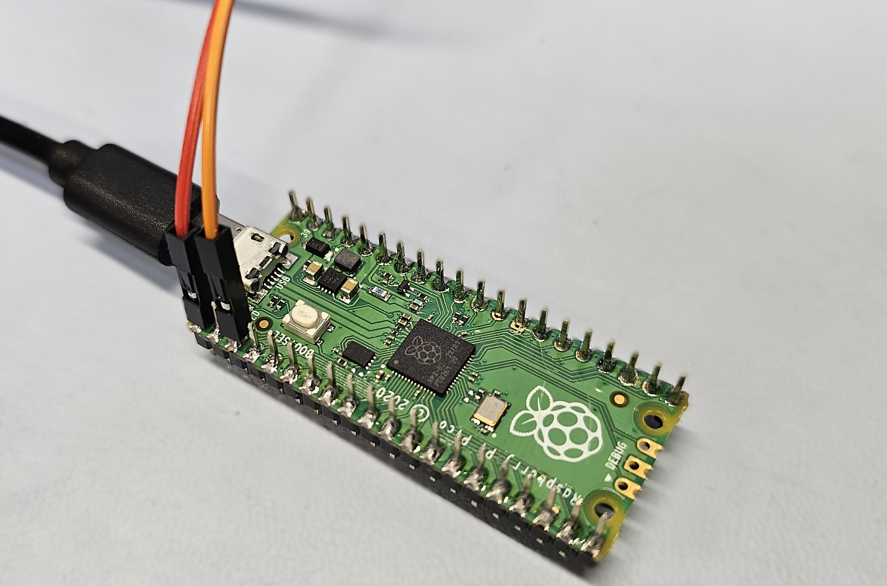
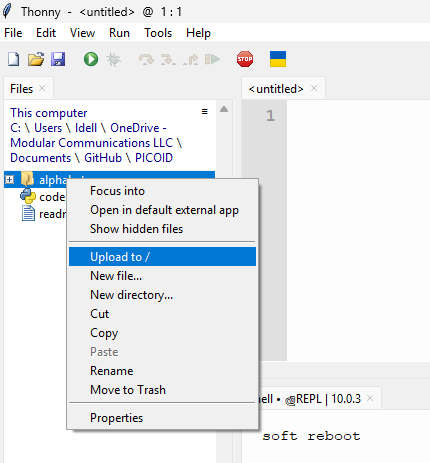
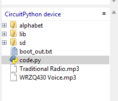

# Pico-ID
## Repeater ID / Repeating MP3 player for Ham / GMRS / Commercial Radio
This project allows you to take a raspberry pi pico and create an affordable automatic ID device for repeaters.

## Features
- CW mode allows pre-set text to be converted to a CW ID
- MP3 mode allows the user to upload a mono < 64Kbps mp3 file to be played
- Random MP3 - allows you to give it a list of MP3 files that it will have a 1 in x chance of playing instead of the primary mp3 or CW ID
- Configurable Delay

## Limitations
- Currently does not key up the radio. I'd like to add the option to control a relay over the GPIO pins in the future, but for our use we did not need it.

## Hardware Requirements
In some cases, the Pi Pico on its own will be enough. It will output a very low volume signal out of GPIO pin 0 (to be paired with GND). You can try this first, and depending on the input requirements it may work.

In cases where more volume is needed, a cheap amplifier such as the [Adafruit Mono PAM8302](https://www.adafruit.com/product/2130) will work wonderfully and allow volume to be adjusted.

## Configuration
Download and clone this repository and modify the code.py file to set it up how you want. There is a configuration section.

## Installation
1. [download the latest CircuitPython UF2 file](https://circuitpython.org/board/raspberry_pi_pico/) (currently 10.0.3)
2. While pressing and holding the `BOOTSEC` button on the pi pico, connect it to your computer. In the folder that shows up, drag and drop the UF2 file. This will install the python library required for this script to work.
3. Disconnect and Reconnect the Pi Pico
4. Download and install [Thony](https://github.com/thonny/thonny/releases)
5. In Thony, Go to `Tools -> Options` and select the `Interpreter` tab
6. Select `CircuitPython (Generic)` and select the COM port of your Pi Pico, or choose `Try to detect port automatically`.
7. Click `View -> Files` and browse to the downloaded and extracted contents of this repository.
8. Right click the "alphabet" folder and click `Upload to /` to upload the folder to the pi

9. Right click "code.py" and click `Upload to `/`
10. You should now see the alphabet folder and code.py in the CirtcuitPython tab

11. Select the console. Press CTRL+C to cancel any currently running scripts, and press Ctrl+D to run a `soft reboot` to test it (also useful after changing settings to test)

Code is based on this project https://learn.adafruit.com/mp3-playback-rp2040/pico-mp3
